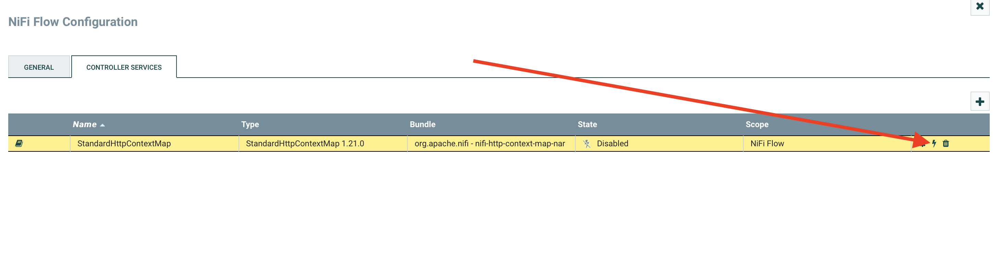

# XmlToJsonProcessor

XmlToJsonProcessor is a custom processor for Apache NiFi that processes 
patients data according to given rules.

## Installation

Use docker compose file in the root of the project to build 
the processor and start the NiFi.

```bash
docker-compose up -d
```

That process may take some time.

## Usage

Open http://localhost:8090/nifi/ in your browser.

In opened NiFi window, in "Operate" block, click 
on the "Upload Template" button as shown on the screenshot below.


Then click on the "Select" button and select
"patient-processing-flow.xml" from the root of this project.


Now the flow should be imported. 
The next step - is to add it to the field.

Move "Template" from the top bar to the field


"patient-processing-flow" should be selected automatically. Click "Add".

Now the flow should be added.

The next step - you should go to the flow configuration.
Press on the button shown below.


Go to "Controller Services" tab.
Here you can see "StandardHttpContextMap" that was created by importing the flow.
Click on "Enable" button as in shown on screenshot below.



Now we can close configuration window.

The last step - is to start the flow. Click on the start button in 
"Operate" block.

Now the flow is working. And waiting for http requests at localhost:8095.


